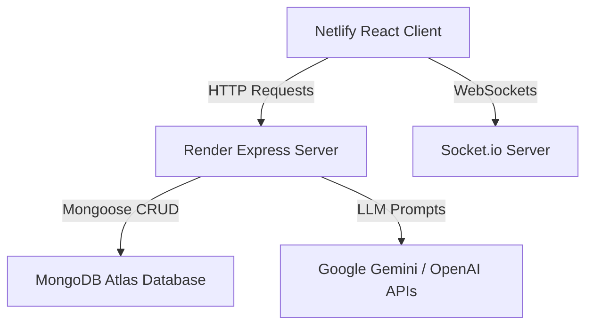

# VIRTUAL-LAB: Collaborative 2D Physics Digital Twin

VIRTUAL-LAB is a real-time, multi-user 2D physics sandbox and digital twin environment designed for interactive learning. The platform allows students and instructors to construct mechanical systems, test structural constraints, observe real-time kinematics telemetry, and collaborate inside shared workspace chambers.

---

## The Problem and Solution

* **The Problem**: Accessing physical laboratory equipment for mechanics experiments is costly, restrictive, and difficult for remote education. Traditional web-based physics simulators are single-player, static, and lack interactive instruction.
* **The Solution**: VIRTUAL-LAB transforms physics education by offering a multiplayer sandbox. Users can construct experiments (such as pendulums, spring systems, and projectile launchers), track live velocities and forces on graphs, consult an interactive AI physics tutor, and collaborate in real-time within virtual classrooms.

---

## Technical Architecture

VIRTUAL-LAB is built as a decoupled monorepo system:



* **Client**: React, Vite, and Tailwind CSS. Heavy physics calculations run at 60 FPS in a Matter.js engine isolated from standard React render loops using React refs.
* **Server**: Node.js and Express server managing API sessions, experiment database persistence, socket routing, and AI integrations.
* **Database**: MongoDB cloud cluster storing credentials, experiment history metadata, and serialized canvas layouts.

---

## Technical Highlights and Innovations

* **React-to-Matter.js Bridge (60 FPS Performance)**: Standard React state updates and virtual DOM diffing are too slow for high-frequency physics loops. VIRTUAL-LAB instantiates the Matter.js physics engine, runner, and renderer inside React refs, executing changes via a direct imperative API (using forwardRef and useImperativeHandle). This keeps canvas calculations at a locked 60 FPS.
* **30Hz Delta Socket Replication**: To coordinate simulation state among multiple peers, the Room Host broadcasts rigid body attributes (coordinates, angles, velocities) throttled at 30Hz. Spectator clients receive these updates and apply linear interpolation (lerp) at 60Hz, ensuring smooth visual replication.
* **Mutex Collision Resolution Locks**: Grabbing or dragging a physics body fires a socket event acquiring a room-wide mutex lock. If other students attempt to drag the same object, their constraint is automatically broken. Grabbed objects display a visual red border outline on peers' screens.
* **Throttled Analytics Sampling**: The inspector plots real-time curves (displacement, velocity) on Recharts line graphs. To prevent DOM repaint chokes, telemetry updates are throttled to 150ms samples (~6.6Hz).
* **Automated Keep-Alive Heartbeat**: Free tier servers on platforms like Render sleep after 15 minutes of inactivity. We built a native self-ping interval scheduler targeting the deployment URL every 14 minutes, keeping the backend service awake 24/7.
* **Intelligent Environment Sanitization**: Handled deployment environment string anomalies by automatically sanitizing, trimming, and stripping surrounding quotes from the MONGODB_URI variables to prevent startup database failures.

---

## Key Features

1. **Interactive Physics Canvas**: Create rigid body shapes (boxes, circles, and polygons) and interact with them using a drag-and-drop mouse constraint.
2. **Simple Harmonic Motion Presets**: Instantly spawn pendulums, spring oscillators, friction slopes, elastic colliders, plank suspension bridges, and catapult launchers.
3. **Real-Time Telemetry & Recharts Graphs**: View velocity X, displacement X, and absolute speed curves on live line charts.
4. **Live AI Physics Professor**: Inline chatbot providing formula explanations (such as spring constant formulas and projectile kinematics) with Gemini/OpenAI API integration and custom local rules-based fallback.
5. **Multiplayer Workspaces**: Instant room code generation, active classroom user rosters, and integrated system-wide chat.
6. **Experiment Library Persistence**: Full serialization of rigid bodies and constraints, stored in MongoDB, allowing students to save and reload layouts.

---

## Project Structure

```
virtual-lab/
├── client/                     # React frontend built with Vite
│   ├── src/
│   │   ├── components/         # Canvas and panel layout modules
│   │   ├── context/            # React state context providers
│   │   ├── App.jsx             # Main layout orchestrator
│   │   └── index.css           # Global stylesheets
├── server/                     # Node.js Express backend
│   └── src/
│       ├── models/             # Mongoose schemas
│       ├── routes/             # REST API endpoints
│       └── server.js           # Server entry point
├── docs/                       # Project documentation
└── README.md                   # Project README
```

---

## Installation and Setup

### Prerequisites
* Node.js (v18 or higher)
* MongoDB (running locally or a cloud database instance on MongoDB Atlas)

### 1. Backend API Server Setup

1. Navigate to the server directory:
   ```bash
   cd server
   ```

2. Install dependencies:
   ```bash
   npm install
   ```

3. Create a `.env` file by copying the example template:
   ```bash
   cp .env.example .env
   ```

4. Configure the environment variables in `.env`:
   * Set `PORT` (default is `5000`)
   * Set `MONGODB_URI` to your connection string. 
     * Local MongoDB example: `mongodb://127.0.0.1:27017/virtual-lab`
     * MongoDB Atlas example: `mongodb+srv://<username>:<password>@cluster0.mongodb.net/virtual_lab`

5. Start the server in development mode:
   ```bash
   npm run dev
   ```

   Once running, the server listens at `http://localhost:5000/` and logs:
   ```text
   VIRTUAL-LAB server listening on port: 5000
   MongoDB Database Connected successfully!
   ```

### 2. Client Setup

1. Navigate to the client directory:
   ```bash
   cd ../client
   ```

2. Install dependencies:
   ```bash
   npm install
   ```

3. Run the Vite development server:
   ```bash
   npm run dev
   ```

4. Open the application in your browser at `http://localhost:5173/`.

---

## Core API Routes

### Authentication
* `POST /api/auth/register` - Registers a new user.
* `POST /api/auth/login` - Authenticates a user and returns a JSON Web Token (JWT).

### Experiment Library
* `GET /api/experiments` - Retrieves all saved experiment layouts for the authenticated user.
* `POST /api/experiments` - Saves the current physics world configuration (bodies and constraints).
* `DELETE /api/experiments/:id` - Deletes a saved layout.

### AI Assistant
* `POST /api/ai/chat` - Generates contextual explanations of physics experiments based on simulation state.

---

## Project Documentation

For detailed guides and architecture deep-dives, refer to the files in the `docs` directory:
* [docs/architecture.md](file:///c:/Users/kedar/Desktop/virtual%20lab/docs/architecture.md) - React state architecture and Matter.js bridge.
* [docs/database-design.md](file:///c:/Users/kedar/Desktop/virtual%20lab/docs/database-design.md) - Database schema layouts.
* [docs/api-documentation.md](file:///c:/Users/kedar/Desktop/virtual%20lab/docs/api-documentation.md) - REST API endpoints and payloads.
* [docs/socket-events.md](file:///c:/Users/kedar/Desktop/virtual%20lab/docs/socket-events.md) - WebSocket event lifecycle maps.
* [docs/deployment-guide.md](file:///c:/Users/kedar/Desktop/virtual%20lab/docs/deployment-guide.md) - Production server deployment guide.
* [docs/viva-questions.md](file:///c:/Users/kedar/Desktop/virtual%20lab/docs/viva-questions.md) - Conceptual physics and web architecture questions.
